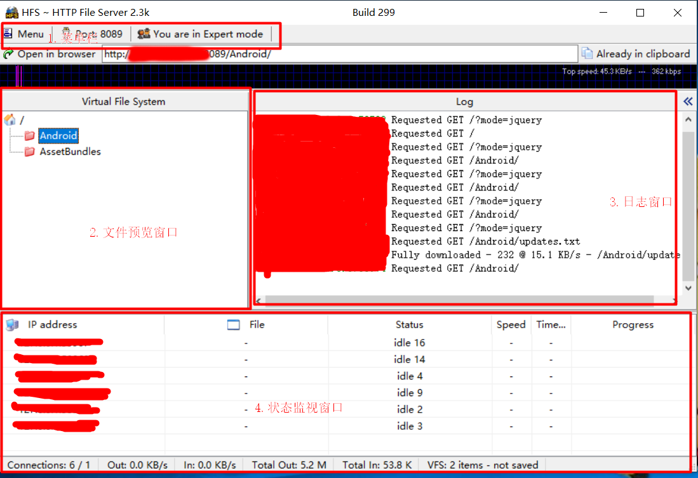
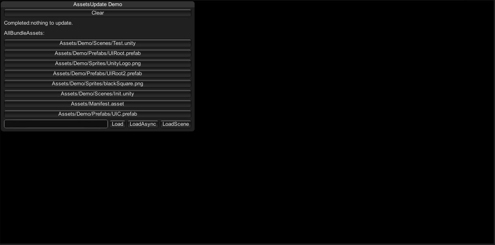

## HFS 轻量级HTTP Server快速入门指南  

#### 简介  
鉴于许多同学想在手机上测试XAseet，但是苦于搭建Apache服务器需要一些步骤、浪费了一些不必要的时间。因此为大家提供了一个极简的轻量级HTTP Server服务器 HFS。
该软件轻量小巧，绿色免安装，拆箱即用，大小只有2.38MB。该软件界面预览图如下：  
  

* 区域1：菜单栏，一些配置等基本操作
* 区域2：文件预览窗口，你可以在这里查看并添加电脑上的文件、文件夹等。凡是添加进来的文件夹就相当于放在了Apache服务器上面，通过浏览器或者手机都可以访问
* 区域3：日志窗口，每次的访问、下载等记录都会出现在日志窗口，方便大家比对查看问题
* 区域4：状态监视窗口，可以查看目前有哪些IP在访问本服务器、传输速度，下载进度等等。

#### 如何配合XAsset使用本框架  

* 1.首先启动本服务器，HFS.exe位于XAsset框架的AssetServer目录下。然后修改端口为我们自定义的端口，比如8089。
* 2.将存放AssetBunldes和版本文件的文件夹添加进左侧的文件窗口中，比如图中的 ``AssetBundles`` 和 ``Android`` 目录。
* 3.然后在Unity里面修改 ``Manifest`` 配置文件的DownLoad Url 路径为我们自定义的路径，直接复制HFS中的地址就好。
* 4.转换Unity平台，出相应平台的包，比如Android平台。记得在出包之前要打出对应的AssetBundle并且复制到StreamingAsset目录下。
* 5.运行手机上的游戏，尝试进行热更，如果热更成功不出错的话，就证明流程跑通了，齐活儿！  
* 6.建议可以先在Editor上测试一下，跑通流程以后再出手机包。  

  

