# xasset

xasset 是一个简易轻量的 Unity 资源管理框架，借助 xasset 可以让你的 Unity 项目的在资源管理上有一个更高效稳健的开发环境，如果觉得 xasset 对你有帮助，请 Star 支持。

xasset 大致的功能结构如下图：

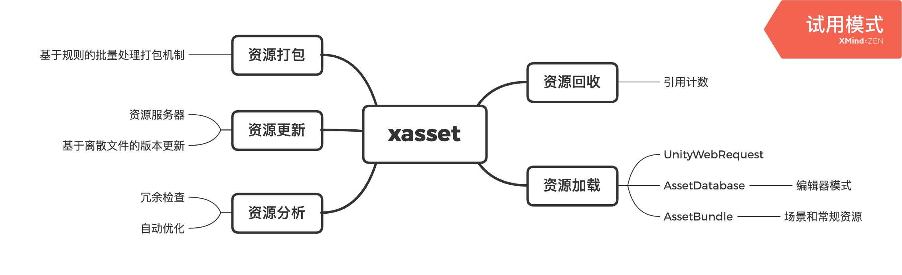

- 主页：<https://github.com/xasset/xasset>
- 视频教程：<https://www.bilibili.com/video/av71508438>
- Q群交流：[693203087](https://jq.qq.com/?_wv=1027&k=5DyV09a)

## 主要特点

- 支持开发模式和发布模式，可以按需打包，开发效率更高
- 基于引用计数管理资源对象生命周期，防止重复加载与轻易卸载，让程序更稳健
- 资源加载使用相对路径寻址，让业务代码不用接触 AssetBundle，降低开发门槛
- 打包前的可视化的冗余检查和自动优化，便于更快的进行资源的分析和优化
- 没有循环依赖问题，资源加载底层对协程无依赖，经得住 Profiler 的检验

## 入门指南

### 资源加载与资源回收

#### 核心接口

- Assets.Initialize 初始化
- Assets.LoadAsset(Async) 加载资源
- Assets.UnloadAsset 卸载资源
- Assets.LoadSceneAsync 加载场景
- Assets.UnloadScene 卸载场景
- Asset.Release 释放资源

#### 初始化

加载资源前，需要先对系统进行成功初始化，下面是用协程进行初始化的代码示例：

```c#
IEnumerator Load()
{
    /// 初始化
    var init =  Assets.Initialize();
    yield return init;
    if (! string.IsNullOrEmpty(init.error))
    {
        Debug.LogError(init.error);
        yield break;
    }
    /// 初始化成功
    ......
}
```

初始化的底层是异步逻辑，调用 Assets.Initialize 后返回的是一个 AssetsInitRequest，在业务层除了使用协程阻塞等待初始化完成外，还可以用 AssetsInitRequest 的 completed 事件接受初始化完成的状态返回，写法类似下面将介绍的加载资源的逻辑，这里就不再一一列举了。

#### 资源加载

使用 xasset 的 API 加载资源时，业务层不需要先加载资源的 AssetBundle 然后再从 AssetBundle 中加载需要的这个资源，而是使用资源在工程中以 Assets 开头的相对路径来寻址，具体可以参考下面的代码示例：

##### 示例1：预制件加载

这里演示的是加载一个预制件：

```c#
var assetPath = "Assets/Demo/Prefabs/UIRoot.prefab";
Assets.LoadAssetAsync(assetPath, typeof(UnityEngine.Object)).completed += delegate(AssetRequest request)
{
    if (! string.IsNullOrEmpty(request.error))
    {
        Debug.LogError(request.error);
        return;
    }
    var go = Instantiate(request.asset);
    go.name = request.asset.name;
    /// 设置关注对象，当关注对象销毁时，回收资源
    request.Require(go);
    Destroy(go, 3);
    /// 设置关注对象后，只需要释放一次 
    /// 这里如果之前没有调用 Require，下一帧这个资源就会被回收
    request.Release();
};
```

> 注：对于 AssetRequest 的 Require 接口，不建议直接使用。这种机制是为了让一开始对资源内存管理没有做好规划的项目可以有一种改动较少然后又能稳妥有效回收资源的方案。使用后可能会对性能有一定影响：底层会在每帧轮询 Require 的对象是否为空，为空了就会释放对应的引用计数。

##### 示例2：场景加载

这里演示的异步加载一个 Additive 的场景：

```c#
IEnumerator LoadSceneAsync()
{
    var assetPath = "Assets/Demo/Scenes/Test.unity";
    var sceneAsset = Assets.LoadSceneAsync(assetPath, true);
    while(!sceneAsset.isDone)
    {
        Debug.Log(sceneAsset.progress);
        yield return null;
    }
    yield return new WaitForSeconds(3);
    /// 回收场景
    Assets.UnloadScene(sceneAsset); // 还可以这样写 sceneAsset.Release()
}
```

##### 示例3：加载没打AB的文本文件

这里演示的是加载一个版本文件，这个文件没有打 AssetBundle，此外 AudioClip 和 Texture 都有这种用法：

```c#
var url = "http://127.0.0.1:7888/OSX/versions.txt";
var asset = Assets.LoadAssetAsync(url, typeof(TextAsset));
asset.completed += delegate
{
    if (asset.error != null)
    {
        OnError(asset.error);
        return;
    }
    var text = asset.text;
    Debug.Log(text)
    /// ...
}；
```

#### 资源回收

xasset 内建了基于引用计数的资源内存管理机制，这种机制下，已经加载的资源不会重复加载，只是资源的引用计数会+1。如果资源的引用计数 > 1, 执行 AssetRequest.Release 也只是减少一次引用计数，当资源的引用计数为 0 的时候，这个资源就会被底层回收，所以写业务的时候 Load 和 Release 是需要配对使用的。

需要注意的是，一些人可能会对 Object.Instantiate 实例化的对象和 Assets.Load 出来的对象存在这样的误解：用Assets.Load 出来的 GameObject 在实例化后，直接 Destroy 实例化后的这个 GameObject，Assets.Load 的 GameObject 就会回收。

然而，实际情况并不是这样的。Object.Instantiate 的对象需要用 Object.Destroy 来回收，并且这个对象 Destroy 之后不等于相关的使用 Assets.Load 出来的资源会回收，对于 Assets.Load 出来的资源你只能通过对应的 Release 接口来回收。

### 资源打包与自动优化

#### 使用 BuildRule 批量高效的进行资源打包分组

为了方便批量高效的进行资源分组，xasset 提供了 Assets/Apply Rule 的工具菜单来给要打包的资源设置打包规则，如下图：

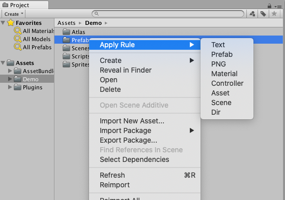

上图中，Text/Prefab/Material/Controller/PNG/Asset/Scene 默认都是同类型的单个文件一组，而使用 Dir 这种规则则是会把同目录下不同类型的多个文件分配到一组，可以自己按需设置。如果针对 Assets/Demo/Prefab 选择 Apply Rule/Prefab，会在 Assets/BuildRules 文件中添加对应的打包规则，如下图：

 

针对 Assets/Demo/Prefabs 目录这条规则表示，该目录下的所有 prefab 在执行规则后，会按默认的方式生成对应的 AssetBundleName，即 prefabs/xxx, xxx 表示没有扩展名的预制件的名称小写。此外，也可以指定一个 AssetBundleName 给这个规则，指定后，和规则匹配的资源都会用这个名字设置对应的打包分组。

需要注意的是，使用 BuildRule 进行资源分组时，默认会对冗余的资源按最小粒度设置打包分组，即每个文件单独设置一个 AssetBundleName 来执行自动优化。具体细节可以参考 BuildRules.cs 的源码实现，这里就不再细说。

#### 使用 AssetBundleBrowser 进行可视化资源打包分组

使用官方的 AssetBundleBrowser 可以在编辑器里面通过Drag & Drop的方式为资源设置 AssetBundle 分组。另外，AssetBundleBrowser 提供了 AssetBundle 资源冗余预警机制，例如上图中带感叹号的资源就在多个 AssetBundle 中出现了冗余，这个时候我们需要把这个资源单独设置 AssetBundle 分组。

关于更多 Unity 官方 Unity Asset Bundle Browser 的介绍，请参考：<https://docs.unity3d.com/Packages/com.unity.assetbundlebrowser@1.7/manual/index.html>

#### 分组建议

如何合理的资源对资源设置AssetBundle分组？建议遵循这些原则：

- 同一时刻同时使用资源设置到一个AssetBundle
- 所有的shader设置到一个AssetBundle
- 同一个图集的所有图元设置到一个AssetBundle
- 尽可能的不使用内建的资源（Shader/Texture&Spritre etc.）

### 版本更新

资源版本更新可以让用户在不需要重新安装应用程序的时候对程序的功能进行更新。实现这个机制后，不单单是应用程序的用户体验会有改变，我们要在目标设备上测试修改的功能也可以不用频繁出包，所以这是一项可以帮助更多人节约时间的实用的功能。

xasset 的 Demo 场景提供了一个简易的基于离散文件的资源版本更新演示程序，业务流程大致如下：

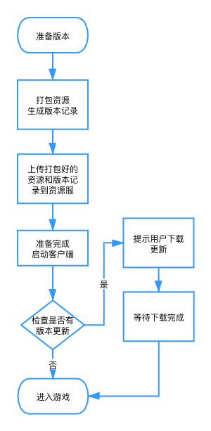

xasset 在打包资源后，会针对打包后的资源生成对应的 versions.txt 版本记录文件，这个文件保存在打包平台对应的输出目录下，如下图中的 versions.txt 就是 OSX 平台打包后输出的版本文件：

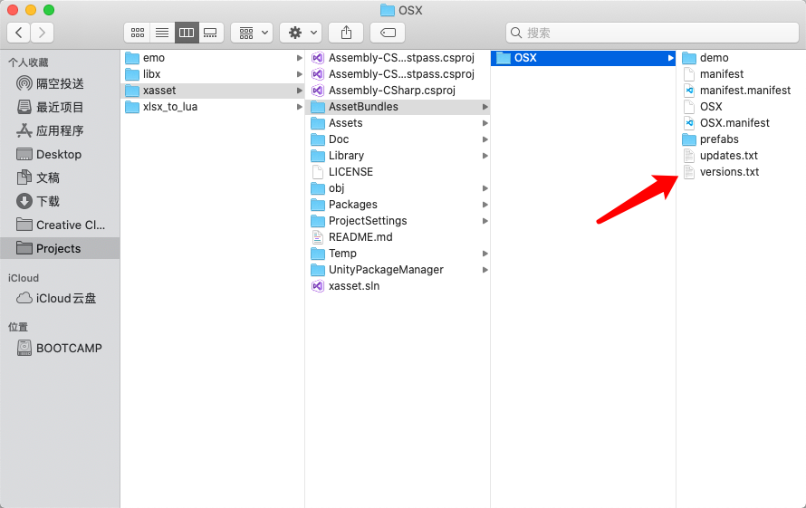

打包完成后，可以在工程下的Settings配置文件中，开启本地服务器测试版本更新，如下图：

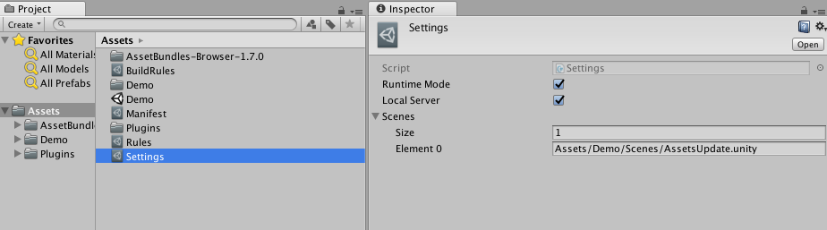

Settings 中的三个选项对应的含义，可以参考下面的代码片段对应的 Tooltip：

```C#
public class Settings : ScriptableObject
{
    [Tooltip("是否在编辑器下开启加载AssetBundle的模式，开启后需要先打AssetBundle")] 
    public bool runtimeMode = true;
    [Tooltip("是否开启本地服务器器，可以用来做版本更新测试")]
    public bool localServer = false;
    [Tooltip("BuildPlayer 的时候被打包的场景")]
    public string[] scenes = { };
}
```

在 Demo 场景中，版本更新的资源下载路径是内建的本地服务器的地址，如果不想使用内建的本地服务器，可以修改下图中的 Download URL指向到自己搭建的环境，同时把打包后的资源上传到自己的环境中：

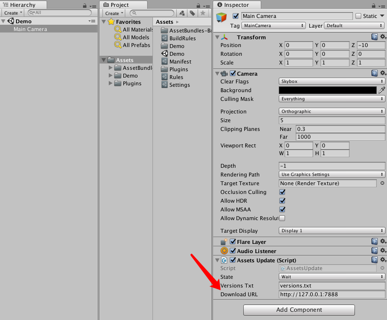

在上面的流程都跑通了后，运行Demo场景会出现这个界面：

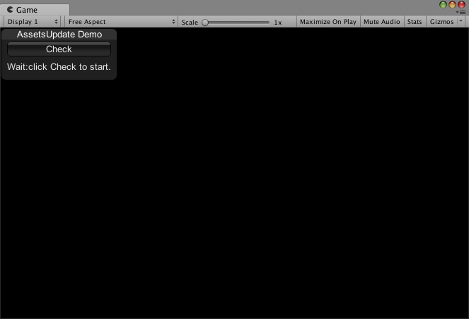

接着点击 Check，如果有资源需要更新，会提示你下载需要更新的资源，如下图：

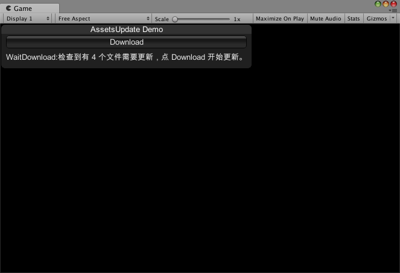

再点击 Download，就会把需要更新的文件下载下来，下载过程中是会显示进度的，但是比较快，这里就不截图了，下载完成后会展示如下界面：

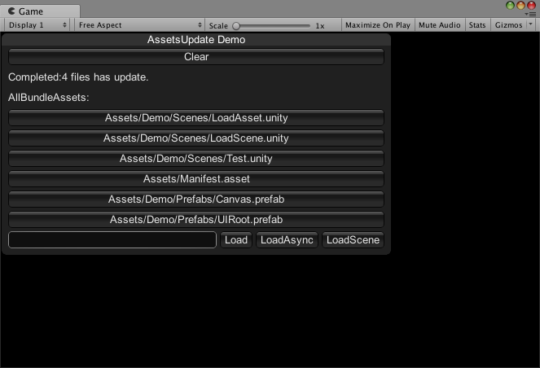

到此，版本更新的流程就完成了，接着我们可以开始进行Profiler测试。

### Profiler 测试

资源管理最怕的就是重复加载和加载了资源按正常的操作不能释放，从而导致程序内存占用过高，加载效率低下，或者出现 crash 情况。使用 xasset 会不会出现这样的情况，我们来看看 Profiler 的结果：

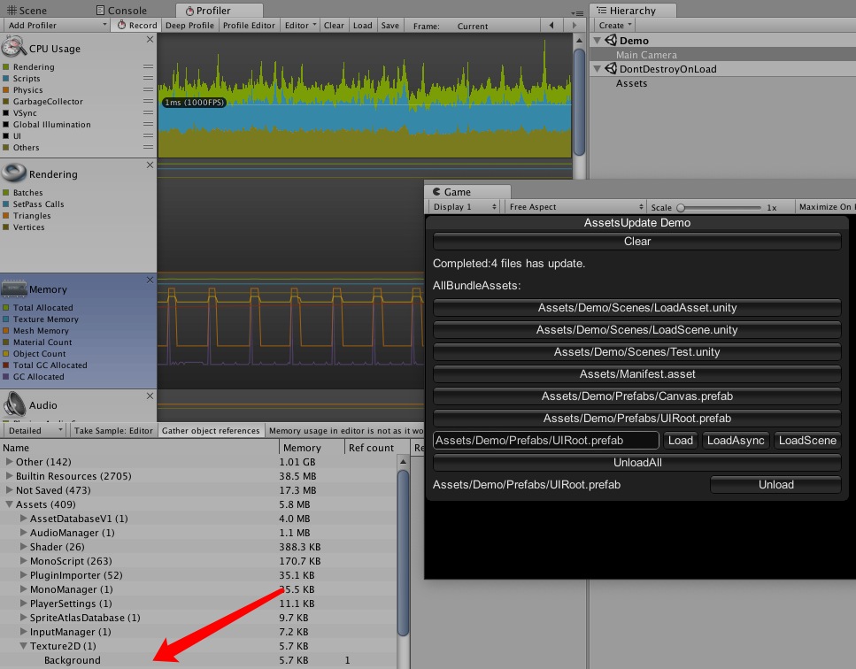

上图的 Backgroud 是在加载 Assets/Demo/Prefabs/UIRoot.prefab 后用 Profiler 采样到的，在点击 Unload 后再采样执行 Take Sample Editor，就可以看到这个 Background 被回收的迹象，如下图： 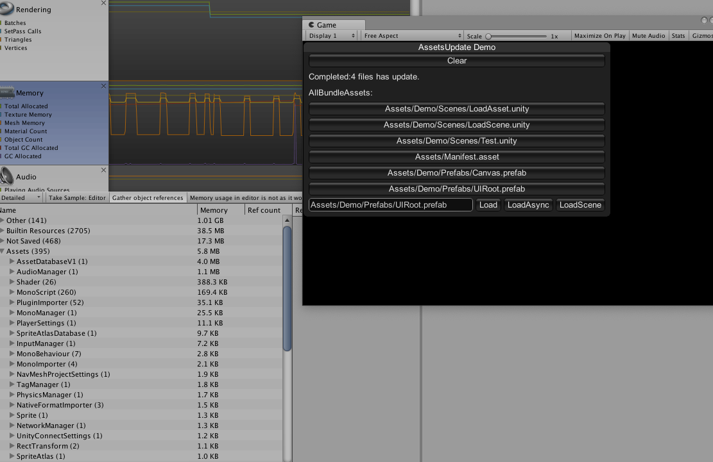

最后，比起用是否来回答 xasset 有没有在正式上线的项目中使用过这个问题，感觉还不如用 Profiler 测试来验证更准确有效。

## Pro 支持

如果需要对 xasset 进行功能定制，或者对项目中的资源进行深度测试分析提供优化建议，可以访问 xasset 的官网关注公众号，通过公众号的微信后台联系我们： <https://www.xasset.org/>

收费标准：按时间收费，最低 200RMB/每小时，会根据需求评估完成时间，不足1小时按1小时收取。

另外 xasset 的官网有少量的广告位出租：每周提供 3 个游戏项目主页展示位置，费用200每周，4周起租。新用户租用广告位 4 周免费赠送一次 Pro 支持，数量有限，先到先得。

注：Pro支持暂时只在周六日或者节假日才会有时间提供服务。

## 开发环境

- 引擎版本：Unity2017.4.x
- 语言环境：.net 3.5
- 操作系统：macOS 10.14.5

## 贡献成员

- [yusjoel](https://github.com/yusjoel)
- [hemingfei](https://github.com/hemingfei)
- [veboys](https://github.com/veboys)
- [woshihuo12](https://github.com/woshihuo12)
- [CatImmortal](https://github.com/CatImmortal) 
- [ZhangDi](https://github.com/ZhangDi2018)
- [QuinShuai](https://github.com/QuinShuai)
- [songtm](https://github.com/songtm)
- [woodelfLee](https://github.com/woodelfLee)
- [LostEarth](https://github.com/LostEarth)
- [Coeur](https://github.com/Coeur)
- [XINCGer](https://github.com/XINCGer)
- [烟雨迷离半世殇](https://www.lfzxb.top/)
- [土豆](https://www.xasset.org/)

## 更多框架

- [ET](https://github.com/egametang/ET) Unity3D Client And C# Server Framework
- [Loxodon Framework](https://github.com/cocowolf/loxodon-framework) MVVM Framework for Unity3D(C# & XLua)
- [QFramework](https://github.com/liangxiegame/QFramework) Your first K.I.S.S Unity 3D Framework
- [emo](https://github.com/xasset/emo) 一个轻量的基于xasset和xLua的gameplay开发框架
- [TinaX Framework](https://tinax.corala.space/) “开箱即用”的Unity独立游戏开发工具
- [LuaProfiler-For-Unity](https://github.com/ElPsyCongree/LuaProfiler-For-Unity) Lua Profiler For Unity支持 XLua、SLua、ToLua
