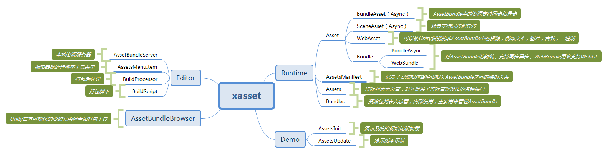
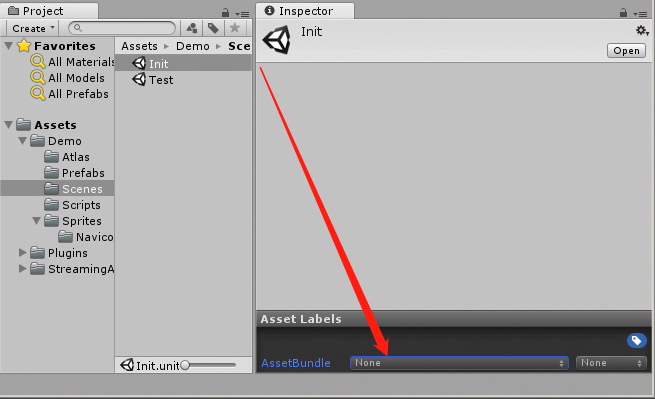
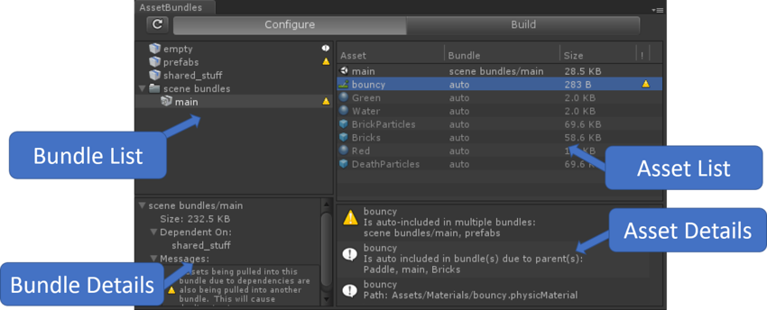
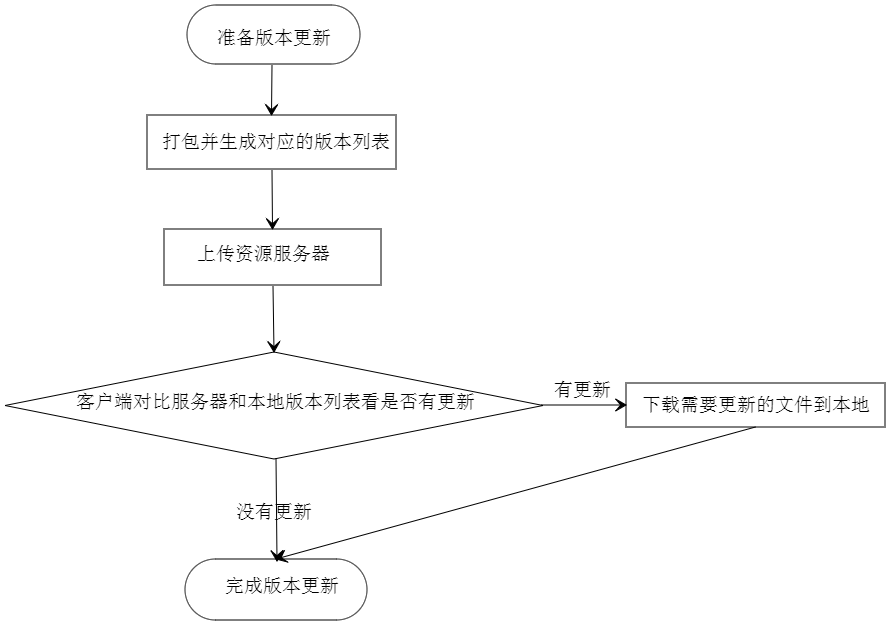
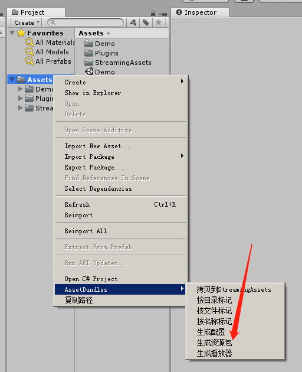
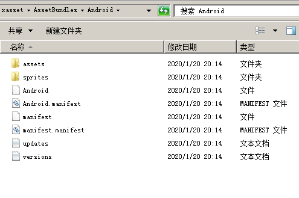
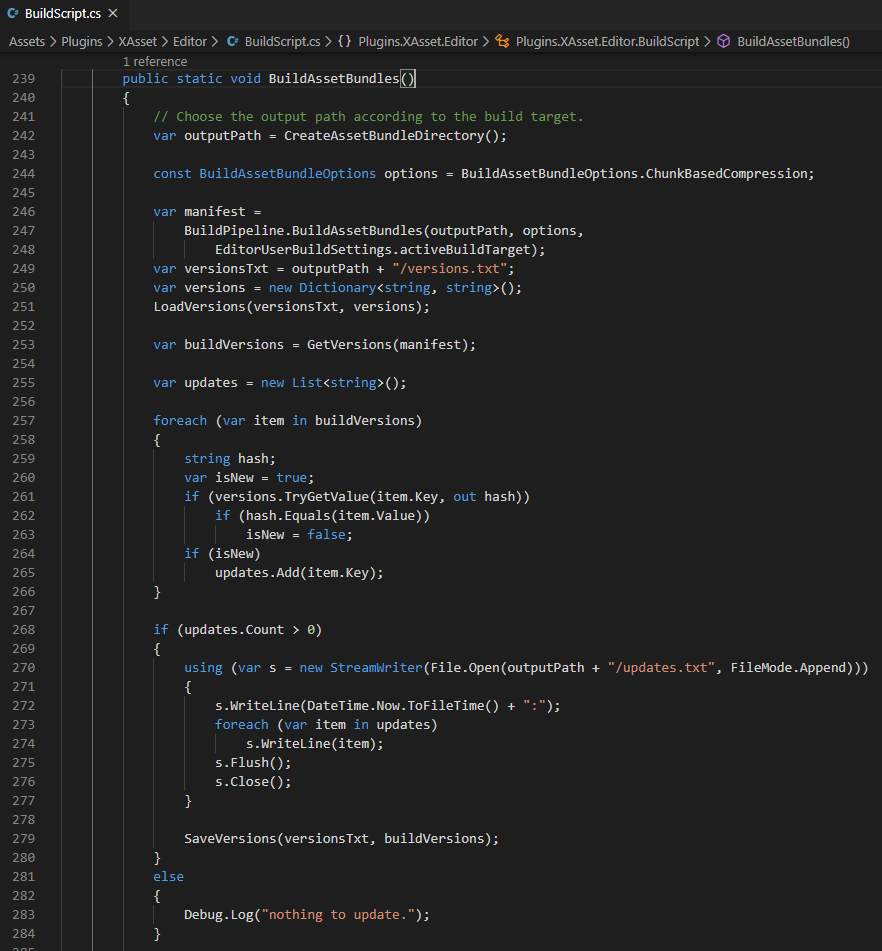
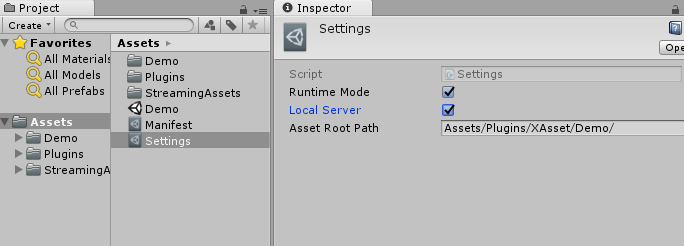
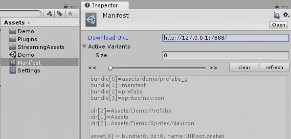

# xasset

xasset 是一个简易轻量的 Unity 资源管理框架，要快速掌握 xasset 可以从下面这张脑图开始：



- 主页：https://github.com/xasset/xasset
- 源码：https://github.com/xasset/libx
- 视频：https://www.bilibili.com/video/av71508438
- Q群：[693203087](https://jq.qq.com/?_wv=1027&k=5DyV09a) 

## xasset 的优势和特点
- 结构精简稳健，不会因为循环依赖中断流程，资源加载对协程无依赖，经得住 Profiler 的考验
- 资源加载使用相对路径寻址，让业务代码不用接触 AssetBundle，降低开发门槛
- 基于引用计数管理资源对象生命周期，防止重复加载，让程序更稳健
- 可视化的资源冗余预警，以及拖拽式的批量打包标记和粒度调整
- 支持开发模式和发布模式，可以按需打包，为开发效率提速

## 入门指南

进行资源加载前，需要先对系统进行初始化，就像下面这样：

```c#
void Start()
{
    Assets.Initialize(OnInitialized, (error) => { Debug.Log(error); }); 
}
```

初始化的底层是异步逻辑，通过两个回调返回结果，成功的结果通过第一个参数返回，如果初始化失败会返回具体的错误原因，初始化成功后我们就可以这样加载资源了：

```c#
private void OnInitialized()
{
   var asset = Assets.LoadAsync(assetPath, typeof(UnityEngine.Object));
   asset.completed += delegate(Asset a) 
   {
      if (a.name.EndsWith(".prefab", StringComparison.CurrentCulture))
      {
         var go = Instantiate(a.asset);
         go.name = a.asset.name;
         /// 设置关注对象，当关注对象销毁时，回收资源
         a.Require(go); 
         Destroy(go, 3);
         /// 设置关注对象后，只需要释放一次，可以按自己的喜好调整，
         /// 例如 ABSystem 中，不需要 调用这个 Release，
         /// 这里如果之前没有调用 Require，下一帧这个资源就会被回收
         a.Release();   
      }
   };
} 
```

上面采用的是异步加载预制件，通过 completed 返回状态，不依赖协程，底层也不会开协程，需要深入了解可以自己看源码，当然，对于异步加载，xasset 也不会阻止你在业务层用协程进行状态返回，比如像下面这样异步加载一个Additive场景业务代码，就可以通过用协程阻塞状态返回:

```c#
IEnumerator LoadSceneAsync()
{
    var sceneAsset = Assets.LoadScene("Assets/Demo/Test.unity", true, true);
    while(!sceneAsset.isDone)
    {
        Debug.Log(sceneAsset.progress);
        yield return null;
    }
    yield return new WaitForSeconds(3);
    Assets.Unload(sceneAsset); // 建议这样写 sceneAsset.Release()
}
```

需要指出的是，对于 Asset 的 Require 接口，通常不建议直接使用，这个接口底层采用的是每帧进行轮询看 Require 的对象是否为空，为空后就释放一次引用计数，这种机制是为了让一开始对资源内存管理没有做好规划的项目可以有一种改动较少然后又能稳妥有效回收资源的方案。

对于资源打包，xasset 主要提供了一些批处理工具，然后再集成了 Unity 官方的 AssetBundleBrower 配套使用。在新版的Unity中，我们主要可以通过以下两种方式为资源设置 AssetBundle 分组：

- AssetImporter.assetBundleName

- AssetBundleBuild

目前，考虑到稳定性和兼容性，xasset使用了第一种方式为资源设置 AssetBundle 分组，xasset 的批处理脚本是这样在代码中给资源设置 AssetBundle 分组的：

```c#
public static void SetAssetBundleNameAndVariant(string assetPath, string bundleName, string variant)
{ 
    var importer = AssetImporter.GetAtPath(assetPath);
    if(importer == null) return;
    importer.assetBundleName = bundleName;
    importer.assetBundleVariant = variant; 
}
```

xasset 的给资源设置 AssetBundle 分组的批处理主要包括了3种类型：

- Assets/AssetBundles/按目录标记

  这种情况下，选中的资源会根据资源的路径名称进行分组，每个目录下面的资源打一组，打包粒度相对较大，比较适合UI贴图类型的资源

- Assets/AssetBundles/按文件标记

  这种情况下，选中的资源会根据资源的文件名称进行分组，每个文件都会打一个组，打包粒度相对较小，比较适合 Prefab 类型的资源

- Assets/AssetBundles/按名称标记

  和按文件标记类似，只是AssetBundleName是根据不包括相对路径的资源名称生成

批处理打包脚本定义在 AssetsMenuItem 脚本中，除了使用批处理脚本外，我们还可以：

1. 使用编辑器的 Inspector 视图给资源设置 AssetBundle 分组

   上面是针对单个资源设置 AssetBundle 分组，在针对目录设置 AssetBundle 分组的时候，目录下的资源在不单独设置分组的时候，都会放到所在的目录分组，这样的好处是不用单独针对目录下的资源设置 AssetBundle 分组，尤其是在有新增资源的时候。

2. 使用官方的 AssetBundleBrowser 给资源设置 AssetBundle 分组

   使用官方的 AssetBundleBrowser 可以在编辑器里面通过Drag & Drop的方式为资源设置 AssetBundle 分组。另外，AssetBundleBrowser 提供了 AssetBundle 资源冗余预警机制，例如上图中带感叹号的资源就在多个 AssetBundle 中出现了冗余，这个时候我们需要把这个资源单独设置 AssetBundle 分组。

如何合理的资源对资源设置AssetBundle分组？建议遵循这些原则：

- 同一时刻同时使用资源设置到一个AssetBundle
- 所有的shader设置到一个AssetBundle
- 同一个图集的所有图元设置到一个AssetBundle
- 尽可能的不使用内建的资源（Shader/Texture&Spritre etc.）

资源加载和资源打包都介绍过了，接下来再来看看资源的版本更新：

资源的版本更新主要包括以下几个环节：

在 xasset 的 Demo 中，主要提供了一种基于离散文件的版本更新机制演示，这种机制的业务流程可以参考这个示意图：

准备版本更新主要是针对我们需要进行更新的资源设置对应的 AssetBundle 分组，分好组后可以在编辑器中执行Assets/AssetBundles/生成资源包 这条菜单命令生成 AssetBundle  和对应的版本文件，如下图：

生成好的资源包和对应的版本文件会根据你当前的构建平台输出到平台对应的AssetBundle输出目录，如下图：

versions.txt 记录了资源文件的版本信息， updates.txt 记录了打包后有更新的内容，可以结合自己项目的实际需要自行扩展这些内容，这两个文件的生成逻辑可以在 BuildScripts.BuildAssetBundles 方法中找到，如下图：

为方便测试，xasset 内建了一个本地的资源服务器，并把 AssetBundle 的输出目录作为工作目录，可以通过勾选Settings 配置文件中的 RuntimeMode 和 LocalSever 进行本地测试，如下图：

Settings 中的三个选项对应的含义分别是：

- LocalServer 开启或关闭本地服务器，可以用来测试版本更新

- RuntimeMode 开启或关闭真机环境，可以用来在编辑器下测试真实的 AssetBundle 加载环境

- AssetRootPath只是为了简化资源使用批处理工具的为资源分组的时候生成的 AssetBundleName 

Settings 文件只会在编辑器下使用，另外的一份 Manifest 文件则用来记录资源相对路径与资源所在的 AssetBundle 之间的映射关系，主要用在 Runtime 时期对资源相对路径关联的 AssetBundle 进行寻址，使用资源的相对路径进行寻址除了可以让业务层不需要关注 AssetBundle 外，更为编辑器开发模式打下了基础，毕竟在编辑器环境下 AssetDatabase.LoadAsset 是通过相对路径加载资源的。

另外，Manifest 文件还定义了两个比较重要的字段:

- DownloadURL 远程资源下载路径，在使用内建的本地服务器需要把地址设置为 http://127.0.0.1:7888/
- ActiveVariants 启用的变种，xasset 目前支持变种加载，变种可以针对同一个 AssetBundle 定义多个版本的实现，在需要进行程序多语言和质量分级的时候可以用的到。

把上面的内容都理清后，就可以开始测试版本更新了。在最新的 xasset 中，只要按把上面的参数设置好，就可以直接运行编辑器的 Demo 场景进行跑版本更新流程，具体可以自行体验。

## 测试环境
- 引擎版本：Unity 5.6.7 / Unity2017.4 / Unity 2018.4
- 语言环境：.net 3.5/.net 4.0 (4.0版本有路径问题，如果发现有报错可以先切回 3.5 环境)
- 操作系统：macOS 10.14.5 

## 捐赠


## 贡献成员

- [yusjoel](https://github.com/yusjoel)
- [hemingfei](https://github.com/hemingfei)
- [veboys](https://github.com/veboys)
- [woshihuo12](https://github.com/woshihuo12)
- [CatImmortal](https://github.com/CatImmortal) 
- [ZhangDi](https://github.com/ZhangDi2018)
- [QuinShuai](https://github.com/QuinShuai)
- [songtm](https://github.com/songtm)
- [woodelfLee](https://github.com/woodelfLee)
- [LostEarth](https://github.com/LostEarth)
- [Coeur](https://github.com/Coeur)
- [XINCGer](https://github.com/XINCGer)

## 推荐框架
 - [ET](https://github.com/egametang/ET) Unity3D Client And C# Server Framework
 - [Loxodon Framework](https://github.com/cocowolf/loxodon-framework) MVVM Framework for Unity3D(C# & XLua)
 - [QFramework](https://github.com/liangxiegame/QFramework) Your first K.I.S.S Unity 3D Framework
