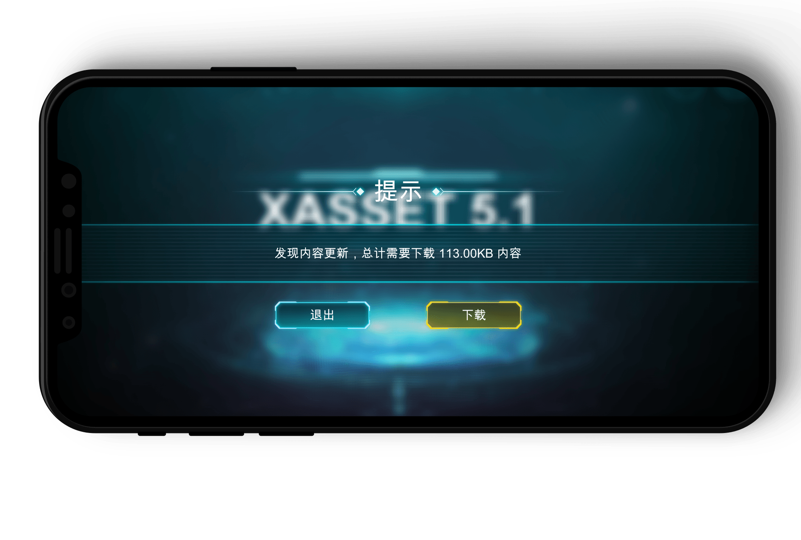
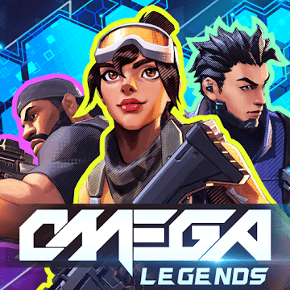

**新版发布**

# XASSET 5.1

全面可靠、轻量高效的Unity资源管理方案

集资源分包、热更新、批量下载、断点续传、异常恢复、版本校验、增量打包、一键出包等功能。轻量敏捷易上手，iOS、Android、PC、Mac等平台资源加载稳定高效，内存管理灵敏可靠。

官网：https://game4d.cn

## 主要特点

满足高效生产和灵活运营的Unity资源管理环境

### 开箱即用

XASSET 5.1核心源码的Demo提供了分包和热更功能的完整演示，从最小首包配置，到初始化和拉取服务器版本信息，包含了首包更新提示对话框，下载进度速度显示等部分，几乎只要替换美术资源就能投入到项目中直接使用，还提供了后续包下载，附加场景加载、循环依赖资源加载回收、异步立即切同步加载等功能的演示，并提供专人解读服务，核心源码和DEMO不到1小时就能快速上手。

### 精细打包

XASSET 5.1只需要为会加载的资源配置打包规则，提供了手动批量设置以及编辑器开发模式自动采集支持，可以快速准确的对成千上万的资源分包分组，每个资源都能进行精细处理，可以按需选择打AB或者不打AB，打AB的资源底层会自动处理依赖关系，自动分析依赖，自动消除冗余，自动解决冲突，大小包、全量包，一键出包，简单配置，快速切换，增量打包，操作简单，容易掌握。

### 灵活热更

XASSET 5.1支持任意格式的资源的分包和热更，对于需要直接使用Stream加载的资源，例如，Wwise或FMOD的bank文件，不需要使用AB一次加载所有内容到内存，所以内存风险更低。而且，对于AB中的资源，底层会处理资源的依赖关系，让每个分包都能独立使用，已经下载的资源无需重复下载，即下即用，轻松查询下载速度和大小，批量下载、断点续传、异常恢复、版本校验，一应俱全。

### 高效加载

XASSET 5.1支持iOS、Android、PC、MAC等平台的常规资源和场景的同步或异步加载，业务层无需考虑平台相关规范，同一套业务代码无需修改就可以轻易在多个平台运行，底层自动寻址，并且加载资源无需启动协程，iPhone 7真机测试662张贴图，593.74MS异步并行加载创建完成，异步加载没有完成可以立即同步完成，提供开发模式，编辑器无需打包也能秒进游戏，就是这么敏捷高效。

### 灵敏回收

XASSET 5.1的内存管理是一种基于引用计数内存管理策略，不论资源是否加载完成，同一个资源都不会重复加载，并持久缓存避免过早卸载，正在加载的资源，业务层无需等待加载完成，就可以立即操作卸载，低内存、切场景自动回收或按需回收无用资源，依赖管理无烦恼，加载前进多少，卸载后出多少，Profiler内存数据采样灵敏可靠，不依赖WeakReference的语法糖，Lua环境兼容性良好。

## 商业案例

线上500万+安装次数的大厂大作的选择

### [Omega Legends](https://play.google.com/store/apps/details?id=com.igg.android.omegalegends&hl=en_US)

Omega Legends is a sci-fi battle royale shooter set in the near future where the game known as "Ω" has taken the world by storm! Select a Hero and make use of their abilities to defeat the competition. Choose to fight alone or team up with friends in intense battles with one hundred participants. Hunt down enemies, build defenses, or take a stealthy approach, do whatever it takes to be the last one standing!

3W+预定用户次数的精品像素游戏的信赖

### [砰砰军团](https://www.taptap.com/app/192380)

《砰砰军团》是一款实时对战的策略游戏，我们试着去融合视觉和听觉体验，将战斗的动态与音乐的节拍巧妙结合。我们设计了小豆丁这样活泼可爱的造物，并让它们随着鼓点有节奏地战斗，以带给玩家一种全新的游戏体验。我们尽可能地在细节上做到让这些小豆丁的形象变得丰满，战斗之外，还描绘了它们在村子里生活的状态。希望这个游戏不仅可以让玩家体验到紧张，刺激，且欢快的战斗的乐趣，还可以在闲暇之余带给玩家温馨的平和时光。

3个城市不下10家体验店的驾培系统的需要

### [汽车模拟驾驶器](http://www.carshow.com.cn/)

汽车模拟驾驶器是采用仿真技术通过软硬件，通过视觉、听觉、体感营造真实的驾驶环境和视角，展示汽车驾驶的特性和性能，为驾驶学员提供一个虚拟的可靠的驾驶训练环境。学员可以通过模拟器操作部件在虚拟环境中驾驶学习，发生交互，从而提升驾驶技能。在驾驶人培训中运用模拟驾驶器不仅能提高培训效率和质量，而且能够提高大数据运用能力，增强政府服务和监管的有效性。高效采集、有效整合、充分运用政府数据和社会数据，健全政府运用大数据的工作机制，将运用大数据作为提高政府治理能力的重要手段，不断提高政府服务和监管的针对性、有效性。

## 用户评价

助您成功是我们的荣誉

### 大厂大作用户

*“（订阅之前）其实我大概花了有半个月从头写整理项目的资源管理打包这一块然后越搞越多 每个想到遇到的问题 xasset几乎都有现成的并且后续需要分包 剥离resource 也立刻支持了都很符合我项目的需求 我就先花1-2天直接接进来跑给pm看后面就直接说服了 全面转xasset管理资源这一块了”*——来自大厂大作的订阅用户寒晟的真实反馈。

### 独立游戏用户

*“曾经自己写过使用AssetBundle实现热更的框架，发现有各种各样的内存问题。接入XASSET之后。这一切的问题都轻而易举的解决了； 我曾尝试过5w一年的热更新解决方案，和XASSET在热更环节体验上简直没有区别， 但是XASSET提供了更完善的Unity资源加载和内存管理环境，真的非常棒！”*——来自独立游戏的订阅用户Jason的真实反馈。

了解更多请前往：https://game4d.cn.

# XASSET 4.0.2

精简实用、高效安全的Unity资源管理方案。
- Github：<https://github.com/xasset/xasset>
- QQ群：[693203087](https://jq.qq.com/?_wv=1027&k=5DyV09a)

## 主要特点

- 开发模式：编辑器下可以在不用构建AB的环境中使用，平常开发时可以秒进游戏。
- 支持异步加载到同步加载的无缝切换，对协程无依赖：相对于高度依赖协程的方案，这种设计不但在性能上更有优势，同时，业务层可以用更少的Coding写出更优雅高效的并行异步加载业务。
- 用引用计数管理对象生命周期：避免重复加载与轻易卸载，让资源对象的生命周期得到妥善处理。并且没有使用WeakReference，可以更方便在跨语言环境中使用，例如避免Lua和C#的交叉引用导致C#这边需要等Lua先GC才能回收资源。
- 基于规则配置的打包策略，配置好打包规则后，底层会自动收集所有要打包的资源，并分析其冗余和冲突，再进行自动优化，可以有效的解决大部分非内建的资源的冗余情况。
- 非泛型接口设计: 对Lua更友好，可以更方便的在跨语言的环境中使用。

## 了解更多

- 知乎专栏：[XASSET 4.0发布预告](https://zhuanlan.zhihu.com/p/158040305)
- 知乎专栏：[XASSET 4.0入门指南](https://zhuanlan.zhihu.com/p/69410498)

## 测试数据

| VFS在各个平台的IO+对象构建性能（毫秒）        | VFS     | BUILDIN |
| --------------------------------------------- | ------- | ------- |
| PC（Win10+i7=10700F CPU2.9GHz 64位 16GB内存） | 310.76  | 354.88  |
| Android（Sony XZs）                           | 2179.63 | 2740.27 |
| iOS（iPhone 7）                               | 629.10  | 593.74  |
| MacBook Pro（macOS15.5 2.9GHz 6核 i9 64位 32GB内存） | 180.29  | 181.90  |

*注*：大约读取了 662 张贴图资源

## 开发环境

- 引擎版本：Unity2017.4.34f1（已经支持2019）
- 语言环境：.net 3.5（支持.net4.x以及.net core）
- 操作系统：Win 10

## 贡献成员

- [yusjoel](https://github.com/yusjoel)
- [hemingfei](https://github.com/hemingfei)
- [veboys](https://github.com/veboys)
- [woshihuo12](https://github.com/woshihuo12)
- [CatImmortal](https://github.com/CatImmortal) 
- [ZhangDi](https://github.com/ZhangDi2018)
- [QuinShuai](https://github.com/QuinShuai)
- [songtm](https://github.com/songtm)
- [woodelfLee](https://github.com/woodelfLee)
- [LostEarth](https://github.com/LostEarth)
- [Coeur](https://github.com/Coeur)
- [XINCGer](https://github.com/XINCGer)
- [烟雨迷离半世殇](https://www.lfzxb.top/)
- [土豆](https://www.xasset.org/)
- [JasonXuDeveloper](https://github.com/JasonXuDeveloper)
- [大魔王有木桑](https://github.com/yomunsam)
- [suixin567](https://github.com/suixin567)
- [Sven](https://github.com/SvenCheung)
- [liufujingwen](https://github.com/liufujingwen)

## 鸣谢

感谢JetBrains公司提供的使用许可证！

## 更多项目

- [ET](https://github.com/egametang/ET) Unity3D Client And C# Server Framework
- [QFramework](https://github.com/liangxiegame/QFramework) Your first K.I.S.S Unity 3D Framework
- [TinaX Framework](https://tinax.corala.space/) “开箱即用”的Unity独立游戏开发工具
- [LuaProfiler-For-Unity](https://github.com/ElPsyCongree/LuaProfiler-For-Unity) Lua Profiler For Unity支持 XLua、SLua、ToLua
- [JEngine](https://github.com/JasonXuDeveloper/JEngine) 一个基于XAsset&ILRuntime，精简好用的热更框架
